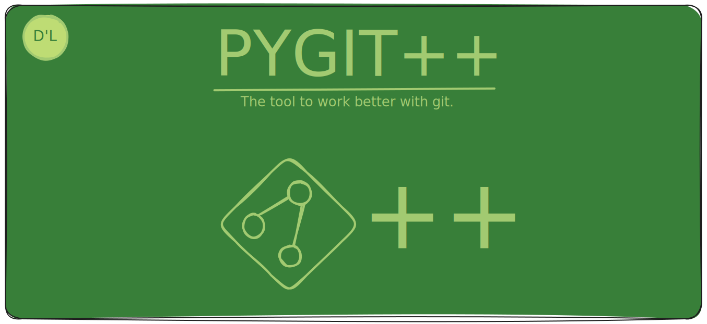

    

> [!WARNING]
> This is work in progress still.
> If you find a bug or have any suggestions
> please feel free to open an issue.

# PYGIT++ DEMONIO

This the source code of the daemon and API 
for the future plugin system that pygit++
will have.
